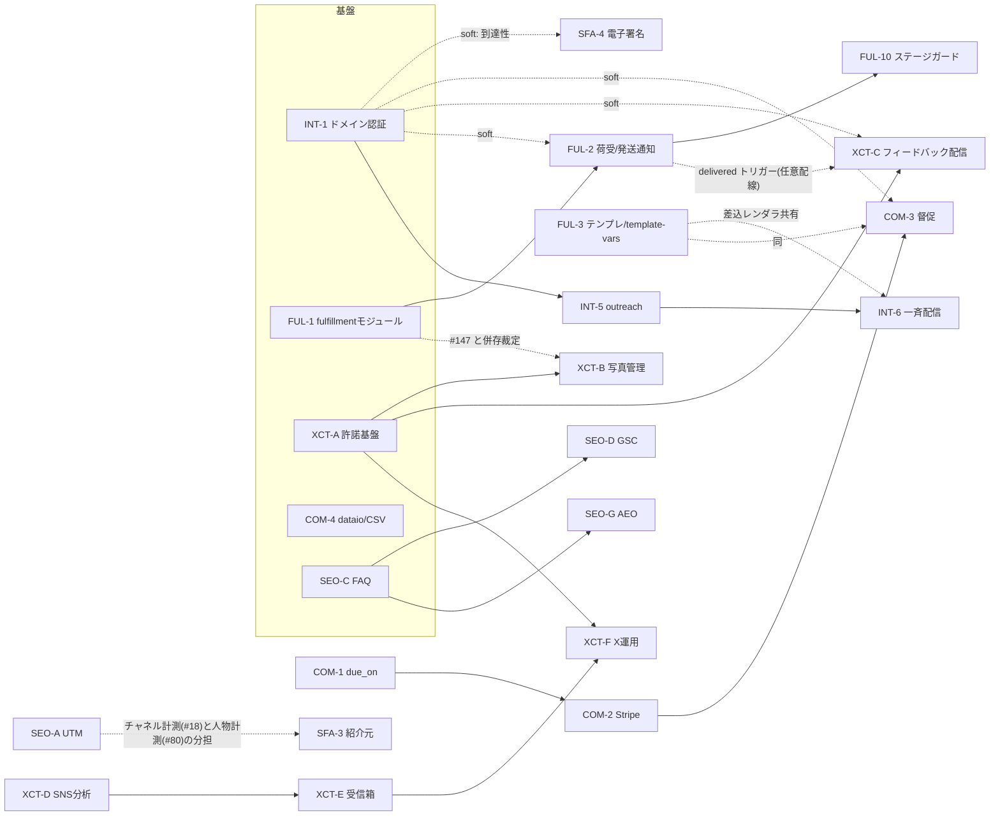

# Growth 統合設計 (00-統合設計.md)

- 版: v1.0 (2026-07-18) / 統合設計担当: Fable
- 対象: 6 トラック詳細設計 (intake-comms-foundation / fulfillment-ops-loop / sfa-deal-hygiene / commerce-billing-data / seo-content-measurement / x-community-trust) の敵対レビュー反映済み最終版の統合
- 本書の役割: **トラック横断で唯一の正となる全体割当 (エラーコード帯・migration 採番・共有資産の裁定) と Wave 実行計画**。各トラック設計書 (同ディレクトリの 5 ファイル + 本書) が Issue 起票の一次ソース。矛盾時は本書が優先。

---

## 1. 全体サマリ

隈部塗装 (1人工房・3D プリント造形物の研磨+塗装・郵送受託・全国対応) の成長施策として、HubSpot ギャップ分析 v2 から採用した約 60 項目を 6 トラック・**48 Issue** に分解した。全トラックの敵対レビュー (Blocker 1 / Major 15 / Minor 多数) を反映済み。

| トラック | key | 中核価値 | Issue 数 |
|---|---|---|---|
| 受付導線・メール基盤・自動応答 | intake-comms-foundation | 到達するメール・写真付き問い合わせ・自動返信・一斉配信 | 6 (INT-1〜6) |
| 受託業務ループ | fulfillment-ops-loop | 荷受け→工程→検品→発送→ポータル→リピートの背骨 | 14 (FUL-1〜14) |
| 商談データ精度向上 | sfa-deal-hygiene | 電子署名承諾・失注分析・停滞防止・紹介元 | 5 (SFA-1〜5) |
| 商務系 (決済・会計・請求・データ) | commerce-billing-data | Stripe 決済・自動督促・会計 CSV・バックアップ・削除請求 | 8 (COM-1〜8) |
| 計測・SEO/AEO・コンテンツ | seo-content-measurement | UTM 計測・GSC・FAQ・AEO・ブランドボイス | 8 (SEO-A〜H) |
| X/SNS コミュニティ・信頼構築 | x-community-trust | 公開許諾・作例資産化・NPS・SNS 受信箱/分析・クラファン | 7 (XCT-A〜G) |

**設計原則 (全トラック共通・遵守済み)**: module-contracts v2.9 準拠 (facade/contracts/repository・Result 型)、1人工房ガード (担当者/ロール/権限系は凍結・設定画面よりコード定数)、#100 メール統合 (emails/email_attachments・E840-859) との非干渉、既存資産の流用 (crm-digest cron / PDF / Twilio / work_templates / #113 ブロック / simulator スナップショット / CMS+メディア / 配信キュー / nav-badges / Resend)。

**新設モジュール (5)**: `outreach` (一斉配信・購読管理) / `fulfillment` (モノの流れ) / `engagement` (許諾・写真・フィードバック) / `dataio` (CSV 入出力) / `seo` (GSC・監査・リダイレクト)。

**敵対レビュー対応**: Blocker 1 件 (XCT: E611 衝突) と Major 15 件を全て設計書へ反映。さらに統合段階で **6 トラック間のエラーコード帯 3 重衝突 (E860-879)・sales/crm 空き番の 2〜3 重衝突・migration 仮採番の衝突**を検出し、§5/§6 の全体割当表で解消した (各トラックのレビューは単独では検出できない性質の衝突)。

---

## 2. 採用項目一覧 (トラック → Issue 対応表)

Issue ID は本書のグローバル ID。各行の詳細仕様は各トラック設計書の該当節を参照。

### intake-comms-foundation (設計書 §2.1〜2.7)

| ID | タイトル | 含む項目 | 規模 | 依存 | Wave |
|---|---|---|---|---|---|
| INT-1 | 送信ドメイン認証と差出人一元化 (SPF/DKIM/DMARC + MAIL_FROM_ADDRESS) | #33 | S | なし | **1** |
| INT-2 | 問い合わせ自動返信・種別分岐・Slack 通知 | #103 #2 #54 | M | なし | **1** |
| INT-3 | 材質×塗料適合マスタ (pricing 拡張) | P18' | M | なし | **1** |
| INT-4 | 写真添付つき依頼フォーム (公開 upload + 実体再検証) | P16' | L | INT-3 | **2** |
| INT-5 | outreach モジュール新設 + 購読解除基盤 (E860 帯) | #32 | M | INT-1 | **2** |
| INT-6 | メール一斉配信 + テンプレート | #3 #5 | L | INT-5 | **3** |

### fulfillment-ops-loop (設計書 §2.1〜2.13)

| ID | タイトル | 含む項目 | 規模 | 依存 | Wave |
|---|---|---|---|---|---|
| FUL-1 | fulfillment モジュール新設 + 案件添付 (#147)・E650-679 帯 | #147 | M | なし | **1** |
| FUL-2 | 荷受け・発送記録と通知メール | P1' P2' P5' | M | FUL-1 | **2** |
| FUL-3 | 営業メールテンプレート (settings キー + template-vars.ts) | #63 | S | なし | **1** |
| FUL-4 | パーツ台帳 + 案件カスタム項目 | P3' #58 | M | FUL-1 | **2** |
| FUL-5 | 調色レシピ管理 | P4' | M | FUL-1, FUL-4 | **4** |
| FUL-6 | 検品記録・リワーク (単一 RPC で lot 加算) | P8' | M | FUL-1, FUL-2 | **3** |
| FUL-7 | アフター不具合チケット | #93 | S | FUL-6 | **4** |
| FUL-8 | 進捗共有とポータル最小版 (app 層合成 + scheduling service-read) | P6' | M | FUL-1, FUL-3(soft) | **3** |
| FUL-9 | 納期回答・受付停止 (scheduling E706/E707) | P10' | M | なし | **1** |
| FUL-10 | ステージガードと自動遷移 (全入口ラッパ結線) | #90 #36 | S〜M | FUL-2 | **3** |
| FUL-11 | リピートオーダー導線 | P11' | S〜M | FUL-4 | **3** |
| FUL-12 | ロット管理・分納 | P9' | L | FUL-2, FUL-6 | **4** |
| FUL-13 | ポータル拡充 | #97 | M | FUL-8, FUL-2 | **4** |
| FUL-14 | アウトバウンド Webhook (v1 fire-and-forget) | #140 #139 | S〜M | FUL-2 | **4** |

### sfa-deal-hygiene (設計書 §1〜5)

| ID | タイトル | 含む項目 | 規模 | 依存 | Wave |
|---|---|---|---|---|---|
| SFA-1 | 失注理由の定型カテゴリ + 案件「分析」タブ (カンバン経路含む) | #71 | S | なし | **1** |
| SFA-2 | 停滞案件アラート (digest + 一覧バッジ) | #89 | S | なし | **1** |
| SFA-3 | 紹介元トラッキング (merge RPC は 000002 基点) | #80 | S-M | SFA-1 | **2** |
| SFA-4 | 電子署名基盤 + 見積オンライン承諾 (版固定 enforce) | #66 | L | INT-1(soft) | **2** |
| SFA-5 | 電子契約 (BtoB 基本契約/NDA) | #67 | M | SFA-4 | **3** |

### commerce-billing-data (設計書 §3.1〜3.7)

| ID | タイトル | 含む項目 | 規模 | 依存 | Wave |
|---|---|---|---|---|---|
| COM-1 | 支払期限 (due_on) + 二段払い支払予定 (列 grant 込み) | #136 | M | なし | **1** |
| COM-2 | Stripe 決済リンクと公開支払ページ (JPY ゼロデシマル) | #130 #131 | L | COM-1 | **2** |
| COM-3 | 未入金請求書の顧客宛自動督促 (独立 try/catch 配置) | #134 | M | COM-1 (COM-2 推奨) | **3** |
| COM-4 | dataio モジュール新設 + 5 エンティティ CSV エクスポート (E880 帯) | #137 前半 | M | なし | **1** |
| COM-5 | 顧客 CSV インポート (#113 全フィールド往復) | #137 後半 | M | COM-4 | **2** |
| COM-6 | freee/MF 仕訳 CSV エクスポート | #135 | M | COM-4, COM-1 | **3** |
| COM-7 | 週次自動バックアップ | #150 | S | COM-4 | **2** |
| COM-8 | 開示データ書き出しと削除請求 (匿名化 — custom_fields='[]') | #146 | M | COM-4 | **2** |

### seo-content-measurement (設計書 §2.1〜2.8)

| ID | タイトル | 含む項目 | 規模 | 依存 | Wave |
|---|---|---|---|---|---|
| SEO-A | UTM/流入元トラッキング (手動取込経路の配線込み) | #18 | M | なし | **1** |
| SEO-B | 広告 CV イベント (GA4 generate_lead 他) | #27 | S | SEO-A | **2** |
| SEO-C | FAQ/ナレッジベース (FAQPage JSON-LD) | #96 | M | なし | **1** |
| SEO-D | seo モジュール新設 + GSC 連携 (E740 帯) | #127 | M | SEO-C(soft) | **2** |
| SEO-E | SEO 監査・ヘルスチェック | #119 #124 | M | SEO-D | **3** |
| SEO-F | URL リダイレクト管理 (catch-all の限界明記) | #117 | S | SEO-D | **3** |
| SEO-G | AEO (JSON-LD 拡充・llms.txt・robots) | #121 | M | SEO-C | **2** |
| SEO-H | ブランドボイス (settingsFacade 直接 read・migration なし) | #129 | S | なし | **1** |

### x-community-trust (設計書 §3.1〜3.7)

| ID | タイトル | 含む項目 | 規模 | 依存 | Wave |
|---|---|---|---|---|---|
| XCT-A | engagement モジュール新設 + 作例公開許諾 (E680-699 帯) | P17' | M | なし | **1** |
| XCT-B | ビフォーアフター写真管理 + works 事例化 (0035 基点の view/RLS 更新) | P7' | M | XCT-A | **2** |
| XCT-C | 納品後フィードバック自動配信 (crm 列挙 read の app 層合成) | #104 #98 | M | XCT-A | **2** |
| XCT-D | SNS 投稿パフォーマンス分析 | #51 | M | なし | **1** |
| XCT-E | SNS 受信箱とリード化 (nav-badges 直 count E003) | #50 | L | XCT-D | **2** |
| XCT-F | X 運用支援 (ハッシュタグ・許諾バッジ・引用RP) | P12' | S | XCT-A, XCT-E | **3** |
| XCT-G | クラファン案件管理 (親子案件 E615/E616) | P13' | M | なし | **1** |

---

## 3. トラック間依存グラフ

- **ハード依存はトラック内のみ**。トラック間は全て soft (無くても degrade 動作) — 並行実装可能な設計を各トラックが保証済み。
- INT-1 は全顧客宛メール (SFA-4 署名依頼 / COM-3 督促 / XCT-C フィードバック / FUL-2 通知 / INT-2 自動返信 / INT-6 配信) の到達率の土台。**最初に完了させる**。
- FUL-2 の delivered トリガー→XCT-C は任意配線 (XCT-C は日次スキャンのフォールバックで単独成立)。
- upload-url kind enum 拡張 (FUL-1 'attachment' / SFA-5 'contract') は同一箇所 — §7.3。

---

## 4. 実装 Wave 順序案 (依存とクイックウィン優先)

| Wave | Issue | ねらい |
|---|---|---|
| **Wave 1** (16 本・全並列可) | INT-1, INT-2, INT-3, FUL-1, FUL-3, FUL-9, SFA-1, SFA-2, COM-1, COM-4, SEO-A, SEO-C, SEO-H, XCT-A, XCT-D, XCT-G | メール到達性 (INT-1) と各トラックの基盤 Issue + 即効の小粒 (自動返信/Slack・失注分析・停滞アラート・納期即答・FAQ・許諾)。日次の手作業と機会損失が即減る |
| **Wave 2** (15 本) | INT-4, INT-5, FUL-2, FUL-4, SFA-3, SFA-4, COM-2, COM-5, COM-7, COM-8, SEO-B, SEO-D, SEO-G, XCT-B, XCT-C, XCT-E | 収益直結 (電子署名承諾・Stripe 決済・写真付きフォーム)・業務ループの起点 (荷受/発送)・資産化 (事例化・NPS)・バックアップ |
| **Wave 3** (11 本) | INT-6, FUL-6, FUL-8, FUL-10, FUL-11, SFA-5, COM-3, COM-6, SEO-E, SEO-F, XCT-F | 自動化の仕上げ (一斉配信・督促・会計 CSV)・顧客体験 (ポータル)・整合 (ステージガード)・再注文 |
| **Wave 4** (6 本) | FUL-5, FUL-7, FUL-12, FUL-13, FUL-14 | スケール系 (ロット・レシピ・ポータル拡充・Webhook)。ブリッジ生産の受注が実際に増えてから効く |

- 1 Issue = 1 PR。Wave 内は並列可だが、**§7 の共有ファイル (crm-digest route / upload-url / 07-contracts-delta) に触る Issue はマージを直列化**する。
- 各 Wave 完了時に `npm run lint` / `npx tsc --noEmit` / vitest green + 本番 migration 適用後 execute_sql 検証 (docker 無し運用 — MEMORY 方針)。

---

## 5. エラーコード全体割当表 (衝突なし保証 — 本表が正)

統合前の衝突: E860-879 を 3 トラック (outreach/dataio/seo)、E650+ を 2 トラック (fulfillment/engagement)、sales E628-631 を 2 トラック (sfa/commerce)、crm E612/E613 を 3 トラック (sfa/commerce/xct) が同時に要求していた。以下で全解消済み (各トラック設計書へ反映済み)。

| 帯 | 所有 | 状態 |
|---|---|---|
| E0xx | nav-badges | 既存 E001/E002 + **E003 SNS 受信箱未読 (XCT-E)** |
| E1xx-E5xx | platform 系既存 | inquiry に **E104 添付検証失敗 (INT-4)** を追加。distribution に **E507-E510 (XCT-D/E)** を追加 |
| E601-E619 | crm | 使用済 E601-**E611** (E611=#113 住所補完 — errors.ts:224)。新規: **E612 紹介元不正 (SFA-3)** / **E613 匿名化不可 (COM-8)** / **E614 匿名化済み書込 (COM-8)** / **E615 親子案件リンク不正 (XCT-G)** / **E616 クラファン入力不正 (XCT-G)**。残 E617-E619 |
| E620-E649 | sales | 使用済 E620-E627, E640-E645 (E643=PDF ロック使用中)。新規: **E628-E631 電子署名系 (SFA-4/5)** / **E632-E636 決済リンク/Stripe 系 (COM-2)** / **E637-E638 支払予定系 (COM-1)** / **E639 督促前提 (COM-3)** / **E646 仕訳生成 (COM-6)**。残 E647-E649 |
| E650-E679 | **fulfillment (新)** | E650-E663 (§2 各項) + **E664 削除拒否 / E665 状態遷移違反** (横断)。E666-679 予約 |
| E680-E699 | **engagement (新)** | E680 トークン / E681 再回答 / E682 許諾遷移 / E683 依頼重複 / E684 写真リンク / E685 許諾なし公開ガード。E686-699 予約 |
| E701-E739 | scheduling | 新規: **E706 テンプレ解決不能 / E707 納期算出不能 (FUL-9)** |
| E740-E759 | **seo (新)** | E740 GSC 未接続 / E741 API 失敗 / E742 リダイレクト入力 / E743 from_path 重複 / E744 ヘルス二重起動 / E745 finding 遷移。E746-759 予約 |
| E760-E799 | (未割当) | 将来のモジュール用に温存 |
| E801-E839 | telephony | 変更なし |
| **E840-E859** | **mail (#100 予約)** | **全トラック使用禁止 — grep 0 件を各トラック受入基準に含む** |
| E860-E879 | **outreach (新)** | E860-E866 (§2.6/2.7。E866=UNSUBSCRIBE_TOKEN_SECRET 未設定)。E867-879 予約 |
| E880-E899 | **dataio (新)** | E880-E888 (CSV/エクスポート/匿名化書出)。E889-899 予約 |
| E9xx | platform (既存 E901/E902) | 変更なし |

**canonical 登録手順**: 新帯 5 本 (fulfillment/engagement/seo/outreach/dataio) と個別コードは、各モジュール新設 Issue (FUL-1 / XCT-A / SEO-D / INT-5 / COM-4) の先頭コミットで **07-contracts-delta.md (裁定 J10) 経由**で module-contracts §1 所有表 + **00-overview §3.3 帯予約表** に追記する (00-overview:946 — module-contracts.md 直接編集禁止)。その際 **E840-859 の #100 予約も帯表に併記** (現表は telephony E839 までで予約が載っていない)。

---

## 6. migration 採番の全体割当 (衝突なし保証)

**ルール (全 Issue 共通)**:
1. ファイル名は `<実装日YYYYMMDD>0000NN_<name>.sql`。**作成直前に `ls supabase/migrations` で当日最大 NN+1 を取る** (過去に 20260714000036 が 3 本並存した事故の再発防止)。
2. 各トラック設計書中の日付入りファイル名 (20260718〜20260725 等) は**全てプレースホルダ**であり、トラック間で衝突している (例: fulfillment と xct が共に 20260720000001 を仮使用)。実採番は本表の「適用順序制約」だけを拘束として実装日で読み替える。
3. 適用検証は本番適用後 execute_sql (docker 無し — MEMORY 方針)。

**migration 一覧と順序制約** (行内の順序のみ拘束。異なる行グループ間は独立):

| Issue | migration (論理名) | 順序制約 |
|---|---|---|
| INT-3 | pricing_materials | なし |
| INT-4 | inquiry_attachments (+bucket) | なし |
| INT-5 → INT-6 | outreach_optouts → outreach_campaigns (+毎分 cron) | INT-5 が先 |
| FUL-1 → FUL-2 → {FUL-5, FUL-6} → FUL-12 | fulfillment_core → fulfillment_shipments (+shipment_id FK) → color_recipes (+recipe FK×2) / inspections (+inspection_id FK+RPC) → deal_lots (+lot FK×3) | 矢印順 (FK 後付けのため厳守) |
| FUL-4 | deal_parts + crm_deal_custom_fields | FUL-1 後 |
| FUL-8 | portal (progress_updates + portal_tokens) | FUL-1 後 |
| FUL-14 | webhooks | なし |
| SFA-1 | crm_deal_lost_category | なし |
| SFA-3 | crm_customer_referral (merge RPC 全文差し替えは **20260715000002 現行本体基点**) | COM-8 の匿名化ガードと同 RPC には触れない (別関数) |
| SFA-4 → SFA-5 | sales_signature_requests → sales_contracts_bucket | 矢印順 |
| COM-1 → COM-2 → COM-3 | sales_payment_schedule (+documents 列 grant) → sales_payment_links (+payments 列) → sales_invoice_reminders (+document_emails.kind) | 矢印順 |
| COM-5 | dataio_import_jobs | なし |
| COM-7 | dataio_export_snapshots (+週次 cron) | なし |
| COM-8 | crm_privacy_requests (+crm_anonymize_customer RPC — custom_fields は '[]') | なし |
| SEO-A | attribution (contact_inquiries + deals) | なし |
| SEO-C | faqs | なし |
| SEO-D | seo_core (4 テーブル一括 — E/F は追加 migration なし) + seo_cron | SEO-D の 1 PR で全テーブル先行作成 (後方分割禁止) |
| XCT-A | engagement_consents | なし |
| XCT-B | deal_photos + works_source_deal (**media view/RLS は 20260711000035 現行定義基点で両方更新**) | XCT-A 後 |
| XCT-C | feedback_requests | XCT-A 後 |
| XCT-D → XCT-E | sns_metrics (+30 分 cron) → sns_inbox | 矢印順 |
| XCT-G | crm_deal_crowdfunding | なし |

deals への列追加 (custom_fields=FUL-4 / attribution=SEO-A / lost_reason_category=SFA-1 / parent_deal_id=XCT-G) は互いに独立列のため順不同。**DDL は全テーブルで revoke-first + 明示 grant** (0026:142-144 の教訓 — commerce レビュー m5 の横断適用)。

---

## 7. 横断的な共通事項

### 7.1 契約改訂ルーティング (全 Issue 共通)
- module-contracts.md は直接編集せず **07-contracts-delta.md 集約 (裁定 J10)** 経由。00-overview §3.3 (エラーコード canonical)・§2 依存グラフ新辺 (outreach→crm / fulfillment→crm / engagement→crm/media/settings / dataio→各 facade / seo→platform/settings) も delta で反映。
- **deals 契約の変更が 4 トラックで発生**: zDealUpdateInput への custom_fields 必須追加 (FUL-4 — silent-wipe 防止で破壊的) が最も影響大。parent_deal_id (XCT-G)・attribution (SEO-A)・lost_reason_category (SFA-1) は optional/別入力で非破壊。**FUL-4 のマージ後に他 3 者が rebase する**ことを推奨順序とする。

### 7.2 crm-digest route (`/api/jobs/crm-digest`) — 最競合ファイル
追記する Issue: SFA-2 (stalled_deals) / SFA-4 (pending_acceptances) / COM-3 (runInvoiceReminders) / COM-7 (バックアップ警告) / XCT-C (scheduleForDeliveredDeals + dispatchDueRequests) / XCT-G (CF リターン納期)。
- **規約**: 送信系の追加処理 (COM-3 督促 / XCT-C 配信) は collectDigest 失敗・isDigestEmpty の**早期 return に依存しない独立 try/catch ブロック**として配置 (1 つの失敗で他を止めない)。digest 表示系 (SFA-2/SFA-4/XCT-G) は CrmDigest/SalesDigest 型 + **isDigestEmpty の判定対象へ必ず追加**。
- マージは直列化 (Wave 内で同時に触らない)。

### 7.3 `/api/upload-url` kind enum 拡張
FUL-1 が `'attachment'` (fulfillment-files)、SFA-5 が `'contract'` (contracts バケット) を追加する。platform 契約 `zCreateUploadUrlReq` の同一 enum — **先にマージした側が enum とバケット分岐の構造 (kind→bucket マップ化) を整え、後発は 1 行追加**にする。
なお INT-4 の公開アップロードは admin 用の本ルートとは**別の新設 route** (`/api/inquiry/upload-url` — anon + rate limit + 実体再検証) であり競合しない。

### 7.4 メール送信の統一規約
- **差出人**: INT-1 の `mailFromAddress()` (src/lib/mail-from.ts) を全送信箇所で使用 — sales/internal/email.ts・inquiry/internal/notify.ts の既存 2 箇所を INT-1 が置換し、以後の新設 (fulfillment/engagement/outreach/督促/自動返信) は最初からこれを import。「許容された重複実装」は 3 箇所目が生まれる本統合を機に lib へ昇格 (INT-1)。
- **差込レンダラ**: FUL-3 の `src/lib/template-vars.ts` (`renderTemplate` — 未解決変数は原文残し) を共通レンダラとし、INT-6 (一斉配信 {{name}}/{{unsubscribe_url}})・COM-3 (督促 {{doc_no}} 等)・XCT-C も同関数を使う (プレースホルダ記法 `{{var}}` を全トラックで統一)。
- **テンプレ機構の役割分担** (重複ではなく層の違い): outreach `email_templates` テーブル=マーケ一斉配信 / settings `sales_email_templates` (#63)=業務 1:1 定型文 / settings `billing.dunning`=督促文面 / settings `auto_reply`=自動返信。DB テーブル化するのは配信キャンペーンのみ。
- **オプトアウト境界 (§1.4 intake)**: マーケ (INT-6) のみ email_optouts 対象。トランザクション (自動返信・帳票・通知・署名依頼・督促・NPS 依頼) は対象外。
- **#100 との境界**: 全トラックが emails/email_attachments に書かず E840-859 不使用。activities(email) と将来の BCC 取込の**重複解消 (de-dup) は #100 側の実装責務** — 各トラックは ref/payload に識別子を残して照合可能にしておく (fulfillment §0.3 の申し送りを全体に適用)。

### 7.5 deal_photos (engagement) と fulfillment_attachments (#147) の併存裁定
**併存を正式裁定とする** (両設計の前提どおり)。役割分担:
- `fulfillment_attachments` = **業務ファイル** (参考画像・指示書 PDF・入荷/検品/出荷写真)。顧客ポータル表示は visible_on_portal で制御。
- `deal_photos` = **営業素材** (before/process/after の工程タグ付き写真)。works 事例化・SNS 転用・クラファン素材の弾倉。
- 運用ガイド 1 行: 「お客さんに見せる進捗写真=fulfillment 添付 / 発信に使う写真=deal_photos」。同一写真を両方に置く必要が頻発したら統合を再検討 (XCT 設計 §5.2 の再裁定ポイント)。

### 7.6 ステージ駆動の裁定 (FUL-10)
'delivered' の駆動源は**発送記録 (物理) が正**。帳票発行による前進 (documents/actions.ts:57/181 の既存経路) は「帳票整合の副次遷移」として存続させ、**checkStageRequirements の app 層ラッパ `guardedUpdateDealStage` を deals action と documents 発行 action の全入口に結線** (迂回経路ゼロ)。

### 7.7 admin ナビ追加 (裁定 J14: グループ内追加のみ)
| 画面 | グループ |
|---|---|
| /admin/outreach お知らせ配信 (INT-6) | お客さんを作る |
| /admin/seo 検索とアクセス (SEO-D) | お客さんを作る |
| /admin/recipes 調色レシピ (FUL-5) | 製造・請求 |
| /admin/contracts 契約 (SFA-5) | 製造・請求 (帳票の隣) |
| /admin/feedback お客様の反応 (XCT-C) | **お客さんを作る に配置 (統合裁定 — 新グループは作らない)** |
| SNS 受信箱/分析 (XCT-D/E) | 既存 /admin/channels 内のタブ (ナビ追加なし) |

### 7.8 settings 新キー一覧 (衝突なし・全て DDL 不要/initial-save 方式)
`auto_reply` (INT-2) / `notifications`+slack_webhook_url optional (INT-2) / `sales_email_templates` (FUL-3) / `intake_status` (FUL-9) / `billing` (+dunning) (COM-1/3) / `accounting` (COM-6) / `analytics`+google_ads_conversion_id `.default(null)` (SEO-B) / `aeo` (SEO-G) / `brand_voice` (SEO-H) / `sns_ops` (XCT-D)。既存キー拡張は全て `.optional()`/`.default()` で後方互換 (strict は未知キー拒否であり default 補完キーは通る)。

### 7.9 Storage バケット新設 (全て private)
`inquiry-uploads` (INT-4) / `fulfillment-files` (FUL-1) / `contracts` (SFA-5) / `exports` (COM-7)。

### 7.10 公開ルート (middleware matcher /admin,/edit 外 — 認証なしで到達)
`/unsubscribe` + One-Click POST (INT-5) / `/portal/[token]` (FUL-8) / `/accept/[id]` (SFA-4) / `/pay/[token]` (COM-2) / `/c/[token]` 許諾 (XCT-A) / `/f/[token]` NPS (XCT-C) / `/faq`・`/llms.txt` (SEO)。全てトークン認可 or 公開情報のみ・noindex・レート制限 or ランダム 256bit トークン。

### 7.11 1人工房ガード (統合確認)
担当者/ロール/権限分岐は全 48 Issue でゼロ (created_by 記録のみ)。しきい値・カテゴリ・ステージ要件はコード定数 (変更要求 2 回で settings 昇格)。Webhook リトライ (FUL-14)・失効 cron (SFA-4)・外部署名ベンダー・API 公開は不採用または昇格条件付き。

---

## 8. 除外項目と理由 (記録)

| 項目 | 理由 |
|---|---|
| #55 案件オーナー/担当者アサイン | 凍結。1人工房では担当者概念自体が不要 (人を雇う日まで) |
| #56 リード自動ラウンドロビン | 凍結 (#55 依存の連鎖凍結) |
| #69 売上フォーキャスト(担当者別) | 凍結 (#55 前提。加重パイプライン 1 本で十分) |
| #159 営業分析(担当者別) | 凍結 (#55 前提。分析軸はグレード×サイズ×材質×リピートが本命) |
| #153 権限セット/ロール・#157 ユーザー管理 UI | 凍結。isAdmin 単一 boolean で十分 |
| #166 職人/チーム別シフト | 凍結相当。会社全体 1 本のキャパ管理が実態に合致 |
| #43 共有受信トレイ | #100 メール統合 (E840-859 予約済) 側で確定済み — 重複回避で除外・依存として扱う |
| #82 メール開封/クリック計測・#101 マクロ | #100 実装時に検討 (レポート明記) |
| #44 LINE 連携 | 主戦場は X・メール。LINE 公式本格運用時に再評価 |
| #49 GBP/MEO | 全国郵送業でローカル検索は主戦場でない。無料の手動整備で足りる |
| P14' イベント出展管理 | 独立新規テーブル/画面が必要で「安い同梱」でない。出展頻度増で単独トラック化 |
| P15' 材料・塗料在庫/原価 | 入力負荷が高く後回し可 (レポート判定・規模 L) |
| #1 フォームビルダー | P16' 受託特化フォームが実質代替 |
| #24 LP ビルダー | 固定ルート追加で代替可 |
| #109 動画ホスティング | YouTube 埋込で代替可 |
| #116 カスタムドメイン | Vercel 設定で対応 — 開発不要 |
| #61 発信通話 | 電話基盤 Phase2 予約済 |
| #145 監査ログ | 採用トラックとの同梱関係が薄い。単独機能として見送り |
| #143 重複バックグラウンドスキャン | 作成時 dedup は既存。単独 cron の同梱メリット薄 |
| #158 カスタムレポートビルダー | 規模 L。P3'/P9' データ蓄積後の後続課題 |
| #155 2FA 強制 | Supabase Auth のプラットフォーム設定 — 運用タスクとして別扱い |
| #57 マルチパイプライン | 規模 M。数量差は当面 P9' ロット管理で吸収 |
| #68 汎用商品カタログ | 価格行列固定運用を当面維持 |
| #60 ミーティング予約ページ | 現地調査消滅で用途縮小 — 見送り |
| #92 繰り返しタスク・#70 目標管理・#38 ライブチャット | 運用/既存 KPI で代替可・意思決定先行が必要 |
| #164 プッシュ通知・#163 PWA・#167 音声メモ CRM | 独立インフラ投資 (M〜XL)。同梱関係薄で見送り |
| #37 CAPTCHA・#31 Cookie 同意バナー | honeypot+レート制限で大半抑止済み |
| #17 キャンペーン管理・#14 セグメント・#28 ROI レポート・#22 Web 接客 | #18 の上位応用だが単体規模 M 以上 — 見送り |
| その他 価値:低 約 85 項目 | 1人工房・全国郵送特化の事業前提で HubSpot 高度機能の再現価値が乏しい (v2 §2.1〜2.10 の「低」行参照) |

---

## 9. レビュー指摘の反映サマリ

| トラック | Blocker | Major | 対応 |
|---|---|---|---|
| intake | 0 | 2 | M1 notifications 現状訂正 (on_publish_failure) / M2 添付の実体再検証+マジックナンバー照合。Minor 7 件反映 (rate limit 署名変更・帯 canonical 登録・Resend 日次会計・E866 分離・グレードなし概算・SettingsFacade 経由・特電法既定) |
| fulfillment | 0 | 3 | M1 エラー帯実測訂正 (E611/E643 使用中) / M2 ポータルの scheduling service-read + app 層合成分解 / M3 帳票発行経路への全入口ゲート結線+delivered 駆動源裁定。Minor 6 件反映 (lot 単一 RPC・J8 注記・FK 実ファイル名割当・E664/E665 分離・Webhook v1 縮退・#100 de-dup 申し送り) |
| sfa | 0 | 3 | M1 markDealLost 呼び元 2 箇所+LostReasonDialog 署名変更 / M2 merge RPC 基準を 20260715000002 現行本体へ / M3 承諾版固定 enforce (E628 拒否+自動 revoke+固定版描画+訂正発行フック)。Minor 4 件反映 |
| commerce | 0 | 3 | M1 documents 列 grant + RPC 機構明記 / M2 CSV 列の #113 全フィールド化+company_name 扱い / M3 匿名化 custom_fields='[]'。Minor 9 件反映 (39 本・citation・独立 try/catch・revoke-first grant・JPY ゼロデシマル・issued 限定・kind 伝播・middleware) |
| seo | 0 | 3 | M1 ai-studio→settings は許可依存 (事実誤認撤回) / M2 brand_voice を settingsFacade 直接 read に簡素化 (ai_runs 列・lease RPC 変更・migration 廃止) / M3 手動取込経路の attribution 配線 3 点。Minor 3 件反映 |
| x-community | **1** | 2 | B1 E611 衝突 → E615/E616 へ再割当 (統合表基準) / M1 deals 列挙の所有違反 → base CrmFacade read 新設+app 層合成 / M2 media view/RLS を 0035 基点で両方更新。Minor 4 件反映 (残弾数訂正・監査粒度裁定・nav バッジ一本化・契約追記の完了条件明記) |
| **統合段階 (本書)** | — | — | トラック間衝突の解消: エラーコード帯 (E860 3 重・E650 2 重・sales E628 2 重・crm E612 3 重) / migration 仮採番衝突 / crm-digest route 競合規約 / upload-url enum 調整 / deal_photos vs #147 併存裁定 / テンプレ機構の役割分担 |

---

## 10. 残オープン事項 (堀さんの判断待ち)

1. **Resend 有料プラン** — INT-6 一斉配信の対象が 100 件を超えた時点で必須 (無料枠 100 通/日)。加入タイミングの判断。
2. **X API Basic 加入** — XCT-D/E の自動同期に必要 (free で手動運用は完結)。伸びを見てから、が設計の既定。
3. **Stripe アカウント** — COM-2 の前提。手数料 3.6% の受容と開設作業。
4. **DNS 手作業 (INT-1)** — Resend ドメイン認証 + Cloudflare レコード追加は runbook 化するが実作業は人手。#100 の受信サブドメインより先に実施が正順。
5. **法務系の運用確認** — 一斉配信の既定 audience=customer のみ ('lead' はオプトイン)・特電法の送信者表示・削除請求フローの文言。設計は反映済みだが運用ポリシーとして一読を推奨。
6. **XCT-C の /admin/feedback ナビ配置** — 統合裁定は「お客さんを作る」グループ内。異論があれば Wave 2 前に。
7. **deal_photos / fulfillment_attachments 併存** — §7.5 の裁定で進める。実装順が入れ替わっても互いに独立で成立する。
